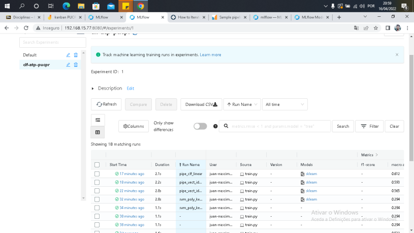

# classificador-texto-analise-sentimentos

**ALUNOS: JUAN MANOEL MARINHO NASCIMENTO E GUSTAVO DA SILVA ROSSI**

## Instale o MLFLOW e Seja Feliz 


```bash
nohup mlflow  server --backend-store-uri  sqlite:///mlflow.db --default-artifact-root  ./artifacts --host 0.0.0.0 --port 8080 &
```



## Install requirementes.txt 

```bash
$ virtualenv env --python=python3
$ source env/bin/activate 


(env) $ pip install requirementes.txt 

(env) $ python train.py

```
